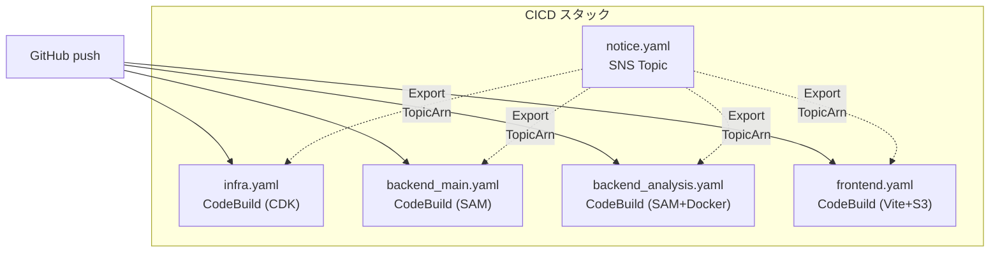
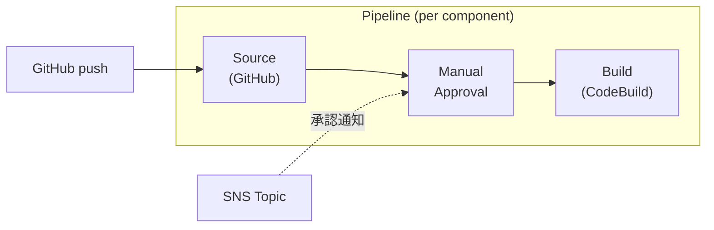

# CICD

各ユニットの CodeBuild プロジェクトを CloudFormation でデプロイするためのテンプレートと、デプロイスクリプトを管理する。

## ファイル構成

| ファイル | 内容 |
|---------|------|
| `notice.yaml` | ビルド通知用 SNS トピック |
| `infra.yaml` | インフラ（CDK deploy）用 CodeBuild プロジェクト |
| `backend_main.yaml` | メイン API（SAM build & deploy）用 CodeBuild プロジェクト |
| `backend_analysis.yaml` | 解析 API（SAM + Docker build & deploy）用 CodeBuild プロジェクト |
| `frontend.yaml` | フロントエンド（Vite build & S3 deploy）用 CodeBuild プロジェクト |
| `pipeline.yaml` | CodePipeline（手動承認 → CodeBuild 実行）テンプレート |
| `deploy_sample.sh` | デプロイスクリプトのサンプル（Webhook 直接実行、dev 向け） |
| `deploy_sample_with_pipeline.sh` | デプロイスクリプトのサンプル（Pipeline 承認フロー付き、pro 向け） |

## アーキテクチャ

### Webhook 直接実行（dev 環境）



### Pipeline 承認フロー（pro 環境）



各コンポーネント（infra, backend-main, backend-analysis, frontend）に独立した Pipeline が1本ずつ作成される（計4本）。

CodeBuild テンプレートは `SourceType` パラメータで動作を切り替える:
- `GITHUB`（デフォルト）: Webhook による直接実行
- `CODEPIPELINE`: Pipeline 経由での実行（`EnableWebhook=false` と併用）

## 前提条件

- AWS CLI が設定済みであること（`aws configure` または環境変数）
- GitHub との CodeStar Connection が作成・承認済みであること（後述）
- `backend-analysis` をデプロイする場合、DockerHub 認証情報が SSM Parameter Store に登録済みであること
  - `/DockerHub/UserName`
  - `/DockerHub/AccessToken`

## GitHub 接続（CodeStar Connection）の準備

CodeBuild が GitHub リポジトリを参照するために、事前に AWS コンソールで接続を作成・承認する必要がある。

1. AWS コンソール → Developer Tools → Settings → Connections
2. 「Create connection」→ GitHub を選択
3. 接続名を入力して作成（例: `sgp-github`）
4. 「Pending」状態の接続を選択し「Update pending connection」で GitHub OAuth を承認
5. 承認後、接続の ARN をコピーする（例: `arn:aws:codeconnections:ap-northeast-1:XXXXXXXXXXXX:connection/xxx`）

## デプロイ手順

### dev 環境（Webhook 直接実行）

`deploy_sample.sh` をコピーして環境に合わせた変数を設定し、実行する。

```bash
cp deploy_sample.sh deploy_dev.sh
# deploy_dev.sh の変数を編集
cd CICD
./deploy_dev.sh
```

### pro 環境（Pipeline 承認フロー付き）

`deploy_sample_with_pipeline.sh` をコピーして環境に合わせた変数を設定し、実行する。

```bash
cp deploy_sample_with_pipeline.sh deploy_prod.sh
# deploy_prod.sh の変数を編集
cd CICD
./deploy_prod.sh
```

デプロイ順序:

1. `notice.yaml` — SNS トピック
2. `infra.yaml` — インフラ CodeBuild（`SourceType=CODEPIPELINE`, `EnableWebhook=false`）
3. `backend_main.yaml` — バックエンド（メイン）CodeBuild（同上）
4. `backend_analysis.yaml` — バックエンド（解析）CodeBuild（同上）
5. `frontend.yaml` — フロントエンド CodeBuild（同上）
6. `pipeline.yaml` × 4 — 各コンポーネントの CodePipeline（CodeBuild のエクスポートを参照するため、必ず CodeBuild スタックの後にデプロイ）

## テンプレート詳細

### notice.yaml

ビルド通知用の SNS トピックを作成する。サブスクリプション（メールアドレス等）は手動で追加する。

| パラメーター | デフォルト | 説明 |
|------------|----------|------|
| `Env` | `common` | 環境識別子。`common` にすると dev/pro で共有可能 |

エクスポート:
- `sgp-${Env}-cicd-notice-TopicArn` — SNS トピック ARN

### 全 CodeBuild テンプレート共通パラメーター

以下のパラメーターは `infra.yaml`、`backend_main.yaml`、`backend_analysis.yaml`、`frontend.yaml` の全てに共通。

| パラメーター | デフォルト | 説明 |
|------------|----------|------|
| `Env` | `dev` | 環境識別子 |
| `GitHubBranch` | `main` | ビルド対象ブランチ |
| `CodeStarConnectionArn` | — | GitHub 接続 ARN |
| `SourceType` | `GITHUB` | ソースタイプ（`GITHUB`: Webhook 直接実行, `CODEPIPELINE`: Pipeline 経由） |
| `EnableWebhook` | `true` | GitHub Webhook による自動ビルドの有効/無効 |
| `EnableNotification` | `false` | SNS ビルド通知の有効/無効 |
| `NotificationEnv` | `common` | 通知先 SNS トピックの Env 識別子 |

`EnableNotification=true` にすると、CodeBuild のビルド状態変化（成功・失敗・開始・停止）が SNS 経由で通知される。通知先は `notice.yaml` でエクスポートされた SNS トピック（`sgp-${NotificationEnv}-cicd-notice-TopicArn`）を `Fn::ImportValue` で参照する。

`SourceType=CODEPIPELINE` + `EnableWebhook=false` の組み合わせで、Pipeline 経由のビルドに切り替わる。この場合、CodeBuild の Source は Pipeline が渡す S3 アーティファクトから取得される。

### infra.yaml 固有パラメーター

| パラメーター | デフォルト | 説明 |
|------------|----------|------|
| `DomainName` | — | カスタムドメイン名 |
| `AcmCertificateArn` | — | ACM 証明書 ARN (us-east-1) |
| `HostedZoneName` | — | Route 53 ホストゾーン名 |
| `CognitoAuthDomain` | — | Cognito カスタムドメイン |
| `CognitoCertificateArn` | — | Cognito 用 ACM 証明書 ARN |
| `AllowedIps` | 空 | CloudFront IP 制限（カンマ区切り） |

### pipeline.yaml

コンポーネントごとに独立した CodePipeline を作成するパラメータ化されたテンプレート。

| パラメーター | デフォルト | 説明 |
|------------|----------|------|
| `Env` | — | 環境識別子 |
| `Component` | — | コンポーネント名（`infra`, `backend-main`, `backend-analysis`, `frontend`） |
| `GitHubOwner` | `h-akira` | GitHub リポジトリオーナー |
| `GitHubRepo` | — | GitHub リポジトリ名 |
| `GitHubBranch` | `main` | 監視対象ブランチ |
| `CodeStarConnectionArn` | — | GitHub 接続 ARN |
| `CodeBuildStackName` | — | CodeBuild スタック名（`Fn::ImportValue` で参照） |
| `OutputArtifactFormat` | `CODE_ZIP` | ソース出力形式。`CODEBUILD_CLONE_REF` にすると full git clone になり、サブモジュールが利用可能 |
| `EnableNotification` | `true` | 承認通知の有効/無効 |
| `NotificationEnv` | `common` | 通知先 SNS トピックの Env 識別子 |

Pipeline は3ステージで構成される:

1. **Source** — CodeStar Connection 経由で GitHub からソースを取得
2. **Approval** — SNS 通知付きの手動承認ゲート（7日間の有効期限）
3. **Build** — 既存の CodeBuild プロジェクトを実行

エクスポート:
- `${StackName}-PipelineName` — Pipeline 名
- `${StackName}-PipelineArn` — Pipeline ARN
- `${StackName}-ArtifactBucketName` — アーティファクト S3 バケット名

## 各 CodeBuild プロジェクトの動作

各プロジェクトは対応するリポジトリの指定ブランチへの push をトリガーに実行される。
- **dev 環境**: Webhook により直接 CodeBuild が起動
- **pro 環境**: Pipeline がトリガーされ、手動承認後に CodeBuild が起動

buildspec の内容は各リポジトリの `buildspec.yml` を参照。

### infra

Infra リポジトリで CDK をデプロイする。デプロイ順序の注意：

- `stack-sgp-{env}-infra-cognito` はバックエンドより先にデプロイする必要がある
- `stack-sgp-{env}-infra-distribution` はバックエンド両方のデプロイ後にデプロイする必要がある（API Gateway ID を参照するため）

### backend-main / backend-analysis

SAM で Lambda + API Gateway をデプロイする。アーティファクト用 S3 バケットは `--resolve-s3` で自動管理される。`backend-analysis` は Docker イメージのビルドを含む。

`backend-analysis` はサブモジュールを使用しているため、Pipeline 経由の場合は `OutputArtifactFormat=CODEBUILD_CLONE_REF` を指定する。これにより CodeBuild が full git clone を行い、buildspec の `git submodule update --init` でサブモジュールを取得できる（`env.git-credential-helper: yes` で CodeStar Connection の認証情報を git に引き継ぐ）。

### frontend

ビルド時に CloudFormation エクスポートから以下の値を取得し、`VITE_*` 環境変数として注入する。

| 環境変数 | 取得元エクスポート |
|---------|----------------|
| `VITE_COGNITO_AUTHORITY` | `sgp-{env}-infra-CognitoUserPoolId` |
| `VITE_COGNITO_CLIENT_ID` | `sgp-{env}-infra-CognitoClientId` |
| `VITE_REDIRECT_URI` | `sgp-{env}-infra-CloudFrontDomainName` |
| `VITE_API_BASE_URL` | 固定値 `/api/v1` |

ビルド後、`s3-sgp-{env}-infra-frontend` バケットに同期し、CloudFront キャッシュを無効化する。

## 既知の問題

### NotificationRule の初回デプロイ失敗

`EnableNotification=true` で初めて `NotificationRule` を作成する際、AWS アカウントに **サービスリンクドロール** (`AWSServiceRoleForCodeStarNotifications`) が存在しない場合、デプロイが失敗することがある。

```
Resource handler returned message: "Invalid request provided:
AWS::CodeStarNotifications::NotificationRule"
(HandlerErrorCode: InvalidRequest)
```

**原因**: CodeStar Notifications サービスが EventBridge マネージドルールを作成するために必要なサービスリンクドロールが、初回リクエスト時に自動作成される。このロール作成には最大15分かかるが、NotificationRule の作成はロールの準備完了を待たずに進行するため、タイミングによって失敗する。

**対処**: 10〜15分待ってから再デプロイすれば成功する。一度ロールが作成されれば、以降は発生しない。

詳細は [tmp/notification-rule-error-investigation.md](tmp/notification-rule-error-investigation.md) を参照。
